# Desarrollo

En esta fase se ha llevado a cabo el despliegue de toda la infraestructura necesaria para el funcionamiento de la web corporativa de **CreviPlay** y del gestor de contenidos basado en **WordPress**, utilizando servicios de **AWS** y contenedores **Docker** para garantizar portabilidad, escalabilidad y facilidad de mantenimiento.

## Infraestructura en AWS

Se han desplegado **dos instancias EC2** independientes, ambas en la misma región y con sistema operativo Linux, cada una con un rol claramente diferenciado:

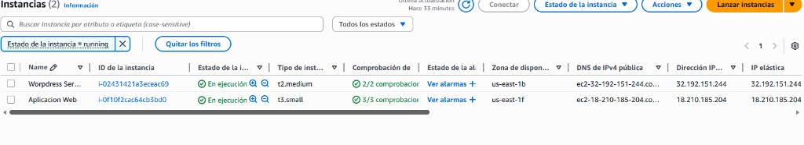

### Instancia 1 – Servidor WordPress

La primera instancia está dedicada exclusivamente a alojar el servidor de **WordPress**:

- Tipo de instancia: `t2.medium`.
- Seguridad gestionada mediante un *Security Group* específico, con las siguientes reglas de entrada:
  - **SSH (TCP 22)** abierto para administración remota.
  - **HTTP (TCP 80)** para permitir el acceso web sin cifrar.
  - **HTTPS (TCP 443)** para futuras conexiones seguras.
- Asociada a una **Elastic IP**, lo que permite disponer de una dirección pública fija para acceder al sitio WordPress desde cualquier lugar.

### Instancia 2 – Aplicación web personalizada

La segunda instancia se encarga de ejecutar la **aplicación web personalizada** desarrollada a medida:

- Tipo de instancia: `t3.small`.
- Seguridad gestionada con otro *Security Group* independiente, también con acceso **SSH (22)**, **HTTP (80)** y **HTTPS (443)**.
- Asociada igualmente a una **Elastic IP** para facilitar el acceso a la aplicación web desarrollada a medida.

Esta separación de instancias permite aislar el CMS de la aplicación personalizada, mejorando la seguridad y facilitando el escalado o mantenimiento independiente de cada servicio.

En ambos casos se han definido *Security Groups* específicos donde se han habilitado de forma controlada los puertos necesarios para SSH y para el tráfico web.

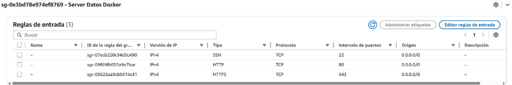

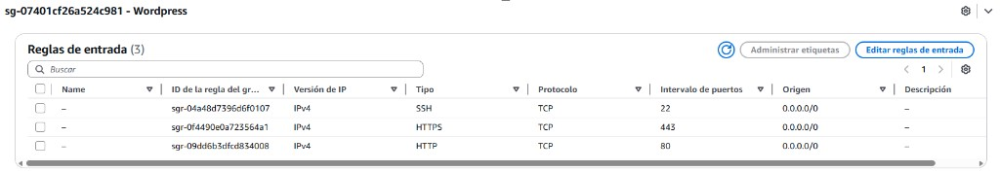

Finalmente, se han asociado **direcciones IP elásticas** a cada instancia para garantizar direcciones públicas fijas.

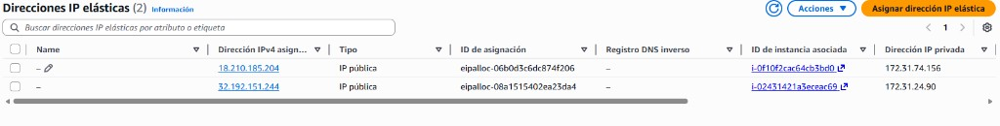

## Despliegue con Docker en el servidor de WordPress

En la instancia destinada a WordPress se ha utilizado **Docker Compose** para orquestar un entorno formado por dos contenedores principales que colaboran entre sí:

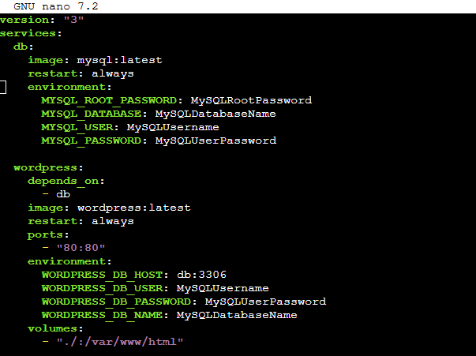

### Contenedor de base de datos MySQL

El primer servicio es la **base de datos MySQL**, responsable de almacenar toda la información del sitio:

- Imagen utilizada: `mysql:latest`.
- Variables de entorno configuradas para definir el usuario administrador, la contraseña de **MySQL** y la base de datos específica para WordPress.
- Política de reinicio `always` para asegurar su disponibilidad continua.

### Contenedor de WordPress

El segundo servicio es el propio **WordPress**, que se conecta a la base de datos anterior:

- Imagen utilizada: `wordpress:latest`.
- Dependencia explícita del contenedor de base de datos mediante `depends_on`.
- Puerto **80** del contenedor expuesto al exterior para servir el sitio web.
- Variables de entorno que conectan WordPress con MySQL (host, usuario, contraseña y nombre de la base de datos).
- Volumen asociado al directorio `/var/www/html` para persistir los datos del CMS.

Con este `docker-compose.yml` se consigue un entorno completo de WordPress, con base de datos y herramienta de administración, totalmente reproducible y fácil de levantar o detener con un único comando.

## Despliegue con Docker en el servidor de la aplicación web

La segunda instancia EC2 aloja la **aplicación web propia de CreviPlay**, desarrollada en **PHP** y conectada a una base de datos **MySQL**. También se ha utilizado **Docker Compose**, en este caso con dos servicios principales claramente diferenciados:

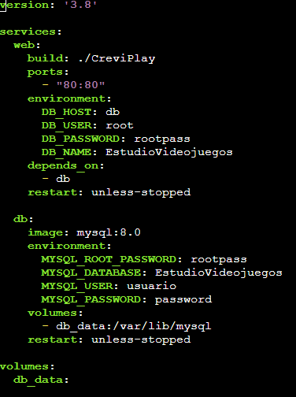

### Servicio `web`

El servicio `web` representa la aplicación PHP que se expone al usuario final:

- Se construye a partir de un **Dockerfile** personalizado.
- Expone el puerto **80** para servir la aplicación web.
- Utiliza variables de entorno para configurar la conexión a la base de datos (host, usuario, contraseña y nombre de la BD `EstudioVideojuegos`).
- Declara una dependencia del servicio de base de datos para asegurarse de que el contenedor de MySQL está disponible antes de iniciar Apache/PHP.

### Servicio `db` (MySQL 8.0)

El servicio `db` es la base de datos de la aplicación:

- Utiliza la imagen `mysql:8.0`.
- Define mediante variables de entorno la contraseña del usuario root, el usuario de aplicación y su contraseña, así como el nombre de la base de datos principal.
- Asocia un volumen persistente (`db_data`) a `/var/lib/mysql` para conservar la información aunque el contenedor se recree.

### Dockerfile de la aplicación PHP

El **Dockerfile** utilizado para construir la imagen de la aplicación se basa en la imagen oficial `php:8.2-apache` e incluye los siguientes aspectos clave:

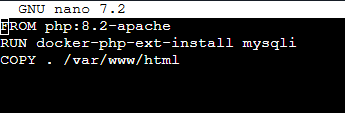

- Instalación de la extensión **mysqli**, necesaria para conectar con MySQL mediante `docker-php-ext-install mysqli`.
- Copia del código fuente de la aplicación al directorio `/var/www/html`, que es el *DocumentRoot* de Apache dentro del contenedor.

Gracias a este enfoque, la aplicación queda empaquetada junto con todas sus dependencias, evitando problemas de configuración entre entornos y facilitando la replicación del servidor en el futuro.

## Instancia 3 - Servicio DNS

Junto a las instancias de **WordPress** y de la **aplicación web**, se ha aprovisionado una **tercera instancia EC2** solo para **DNS**, con **BIND** (`named` en Linux).

### Creación de la instancia

Se ha desplegado el **servidor de nombres** en una instancia propia, separandolo de las demás para tener un control sobre ella.

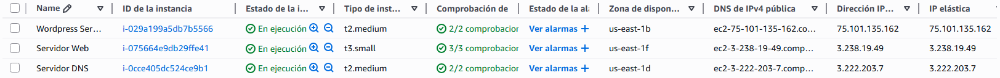

Figura: instancia dedicada al rol DNS, en el mismo criterio de región e imagen base que el resto del despliegue

### Dirección IP Elástica

Con una **Elastic IP** enlazada a la instancia DNS, los **registros** que apunten a esa IP (por ejemplo, un dominio o subdominio) **siguen teniendo sentido** tras un reinicio o un cambio de mantenimiento, sin reetiquetar a mano direcciones que hayan “saltado”.

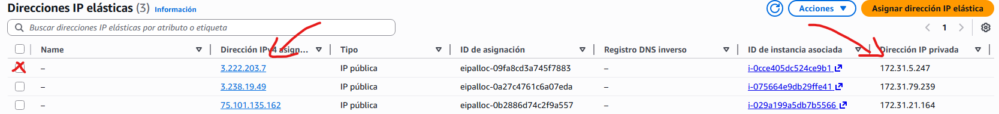

Figura: IP elástica asociada al servidor de nombres, alineada con el enfoque del resto de instancias

### Reglas de red (Security Group)

El **Security Group** restringe la exposición: **SSH (TCP 22)** solo para la administración remota, y **DNS (UDP 53 y TCP 53)** para que clientes o servicios hagan resolución correctamente. Así, la hoja de reglas se puede **revisar de un vistazo** (quién entra, para qué y por qué puerto).

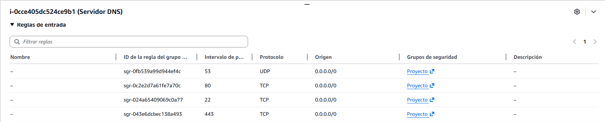

Figura: reglas mínimas para administración (22) y servicio de nombres (53)

### Configuración de BIND: fichero principal e *includes*

**Fichero base** (`named.conf` o raíz de la configuración): directivas, inclusiones hacia el resto de fragmentos e integración con el despliegue de `bind` en el sistema.

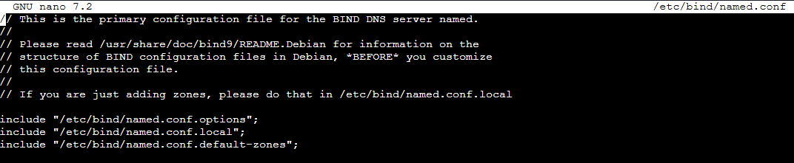

Figura: punto de entrada: referencias a opciones, zonas por defecto y dominios bajo vuestro control

**Archivo named.options**: afinan escucha, política de reenvío o recursión, y criterios de seguridad del demonio, sin mezclar con las definiciones de zona.

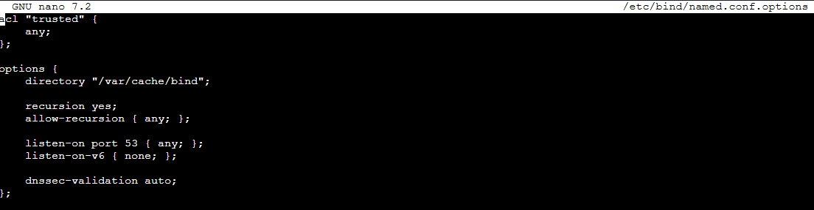

Figura: hoja de opciones: comportamiento del servidor, separada de las definiciones de zona

**Archivo named.conf.local**: declaraciones de `zone` hacia el fichero de **registros** que materializan nombres y destinos reales en el entorno CreviPlay.

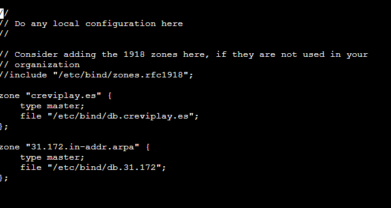

Figura: zona y vínculo con el fichero de datos DNS del proyecto

**Archivo named.conf.default-zones**: deja claro qué resuelve o delega el sistema *antes* de añadir lo propio, y sirve de referencia al contrastar con la **zona local** anterior.

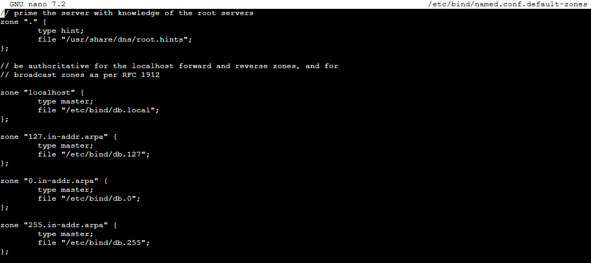

Figura: bloque de includes de zonas predefinidas, como referencia frente a la zona personalizada

## Conclusiones de la fase de desarrollo e implantación

El uso combinado de **AWS EC2**, **Elastic IPs**, **Security Groups** y **Docker/Docker Compose** ha permitido desplegar una infraestructura modular y escalable, en la que:

- WordPress funciona como gestor de contenidos independiente para la parte más corporativa.
- La aplicación PHP personalizada gestiona la lógica específica del estudio de videojuegos.
- El servicio **DNS (BIND/named)** en su propia instancia aporta resolución de nombres alineada con las direcciones públicas fijas del proyecto.
- La separación de WordPress, aplicación y DNS reduce el impacto de posibles fallos y amplía las opciones de crecimiento del proyecto a medio y largo plazo.