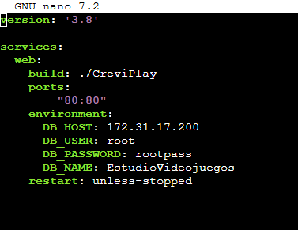
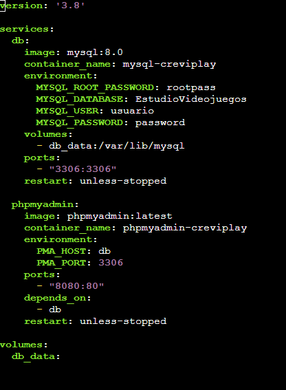

# Desarrollo

En esta fase se ha llevado a cabo el despliegue de toda la infraestructura necesaria para el funcionamiento de la web corporativa de **CreviPlay**, del gestor de contenidos **WordPress**, de la aplicación PHP de gestión del catálogo, del servicio **DNS** y de la base de datos **MySQL**, utilizando servicios de **AWS** y contenedores **Docker** para garantizar portabilidad, escalabilidad y facilidad de mantenimiento.

## Infraestructura en AWS

Se han desplegado **cuatro instancias EC2** independientes, todas en la misma región y con sistema operativo Linux, cada una con un rol claramente diferenciado:

| Instancia | Rol | Tipo | IP privada | Descripción |
|-----------|-----|------|------------|-------------|
| **1** | WordPress | `t2.medium` | Red VPC | CMS corporativo con MySQL propio en Docker |
| **2** | Aplicación web PHP | `t3.small` | `172.31.79.239` | Aplicación de gestión conectada a MySQL remoto |
| **3** | DNS (BIND) | EC2 Linux | Red VPC | Resolución de nombres con Elastic IP |
| **4** | Base de datos | EC2 Linux | `172.31.17.200` | MySQL 8.0 + phpMyAdmin en Docker |

### Instancia 1 – Servidor WordPress

La primera instancia está dedicada exclusivamente a alojar el servidor de **WordPress**:

- Tipo de instancia: `t2.medium`.
- Seguridad gestionada mediante un *Security Group* específico, con las siguientes reglas de entrada:
  - **SSH (TCP 22)** abierto para administración remota.
  - **HTTP (TCP 80)** para permitir el acceso web sin cifrar.
  - **HTTPS (TCP 443)** para futuras conexiones seguras.
- Asociada a una **Elastic IP** (`32.192.151.244`), lo que permite disponer de una dirección pública fija para acceder al sitio WordPress desde cualquier lugar.

### Instancia 2 – Aplicación web personalizada

La segunda instancia se encarga de ejecutar la **aplicación web personalizada** desarrollada en **PHP**:

- Tipo de instancia: `t3.small`.
- IP privada: `172.31.79.239`. IP pública: `18.210.185.204`.
- Seguridad gestionada con otro *Security Group* independiente, con acceso **SSH (22)**, **HTTP (80)** y **HTTPS (443)**.
- Asociada a una **Elastic IP** para facilitar el acceso a la aplicación web.
- En su estado final, aloja **únicamente el contenedor web**; la base de datos se conecta de forma remota a la instancia 4.

### Instancia 3 – Servidor DNS

Tercera instancia dedicada exclusivamente al servicio **DNS** con **BIND** (`named`), con Elastic IP propia y Security Group que expone los puertos **53 (UDP/TCP)** y **22 (SSH)**.

### Instancia 4 – Base de datos MySQL

Cuarta instancia dedicada al motor **MySQL 8.0** y **phpMyAdmin**, con IP privada `172.31.17.200`. El acceso al puerto **3306** queda restringido al Security Group `SQL-Separado`, permitiendo conexiones solo desde la IP privada del servidor web (`172.31.79.239/32`).

Esta separación en cuatro instancias permite aislar el CMS, la aplicación, el DNS y los datos, mejorando la seguridad y facilitando el escalado o mantenimiento independiente de cada servicio.

En todos los casos se han definido *Security Groups* específicos donde se han habilitado de forma controlada los puertos necesarios.

Finalmente, se han asociado **direcciones IP elásticas** a las instancias que lo requieren para garantizar direcciones públicas fijas.

## Despliegue con Docker en el servidor de WordPress

En la instancia destinada a WordPress se ha utilizado **Docker Compose** para orquestar un entorno formado por dos contenedores principales:

### Contenedor de base de datos MySQL

El primer servicio es la **base de datos MySQL** del CMS, responsable de almacenar toda la información del sitio WordPress:

- Imagen utilizada: `mysql:latest`.
- Variables de entorno configuradas para definir el usuario administrador, la contraseña de **MySQL** y la base de datos específica para WordPress.
- Política de reinicio `always` para asegurar su disponibilidad continua.

### Contenedor de WordPress

El segundo servicio es el propio **WordPress**, que se conecta a la base de datos anterior:

- Imagen utilizada: `wordpress:latest`.
- Dependencia explícita del contenedor de base de datos mediante `depends_on`.
- Puerto **80** del contenedor expuesto al exterior para servir el sitio web.
- Variables de entorno que conectan WordPress con MySQL (host, usuario, contraseña y nombre de la base de datos).
- Volumen asociado al directorio `/var/www/html` para persistir los datos del CMS.

Con este `docker-compose.yml` se consigue un entorno completo de WordPress con base de datos, totalmente reproducible y fácil de levantar o detener con un único comando.

## Despliegue con Docker en el servidor de la aplicación web

La instancia 2 aloja la **aplicación web propia de CreviPlay**, desarrollada en **PHP 8.2** con Apache y conectada de forma remota a la base de datos MySQL de la instancia 4.

### Evolución del despliegue

Inicialmente, la aplicación se desplegó con **Docker Compose** en un único servidor que incluía tanto el servicio `web` como el servicio `db` (MySQL 8.0) en la misma máquina:

Tras la migración de la base de datos a su instancia dedicada (instancia 4), el `docker-compose.yml` del servidor web se simplificó para definir **únicamente el servicio `web`**, eliminando el contenedor local de MySQL y apuntando las variables de entorno hacia la IP privada `172.31.17.200`:

Figura: servicio web con conexión remota a MySQL mediante `DB_HOST`, `DB_USER`, `DB_PASSWORD` y `DB_NAME`

### Servicio `web` (estado final)

El servicio `web` representa la aplicación PHP que se expone al usuario final:

- Se construye a partir de un **Dockerfile** personalizado basado en `php:8.2-apache`.
- Expone el puerto **80** para servir la aplicación web.
- Utiliza variables de entorno para configurar la conexión remota a la base de datos (host, usuario, contraseña y nombre de la BD `EstudioVideojuegos`).

- Instalación de la extensión **mysqli** mediante `docker-php-ext-install mysqli`.
- Copia del código fuente de la aplicación al directorio `/var/www/html`, que es el *DocumentRoot* de Apache dentro del contenedor.

### Configuración de conexión (`config.php`)

La aplicación PHP incorpora la configuración de conexión remota en su fichero `config.php`, utilizando variables de entorno en Docker y valores por defecto orientados al entorno de producción:

Figura: constantes `DB_HOST`, `DB_USER`, `DB_PASSWORD` y `DB_NAME` con soporte para entorno Docker y desarrollo local

| Parámetro | Valor |
|-----------|-------|
| **DB_HOST** | `172.31.17.200` |
| **DB_USER** | `root` |
| **DB_PASSWORD** | `rootpass` |
| **DB_NAME** | `EstudioVideojuegos` |

Gracias a este enfoque, la aplicación queda empaquetada junto con todas sus dependencias, evitando problemas de configuración entre entornos y facilitando la replicación del servidor en el futuro.

## Instancia 3 – Servicio DNS

Junto a las instancias de **WordPress** y de la **aplicación web**, se ha aprovisionado una **tercera instancia EC2** solo para **DNS**, con **BIND** (`named` en Linux).

### Creación de la instancia

Se ha desplegado el **servidor de nombres** en una instancia propia, separándolo de las demás para tener un control independiente sobre el servicio de resolución de nombres.

Figura: instancia dedicada al rol DNS, en el mismo criterio de región e imagen base que el resto del despliegue

### Dirección IP Elástica

Con una **Elastic IP** enlazada a la instancia DNS, los **registros** que apunten a esa IP (por ejemplo, un dominio o subdominio) **siguen teniendo sentido** tras un reinicio o un cambio de mantenimiento, sin reetiquetar a mano direcciones que hayan cambiado.

Figura: IP elástica asociada al servidor de nombres, alineada con el enfoque del resto de instancias

### Reglas de red (Security Group)

El **Security Group** restringe la exposición: **SSH (TCP 22)** solo para la administración remota, y **DNS (UDP 53 y TCP 53)** para que clientes o servicios hagan resolución correctamente.

Figura: reglas mínimas para administración (22) y servicio de nombres (53)

### Configuración de BIND: fichero principal e *includes*

**Fichero base** (`named.conf`): directivas, inclusiones hacia el resto de fragmentos e integración con el despliegue de `bind` en el sistema.

Figura: punto de entrada con referencias a opciones, zonas por defecto y dominios bajo control del proyecto

**Archivo `named.options`**: define escucha, política de reenvío o recursión, y criterios de seguridad del demonio, sin mezclar con las definiciones de zona.

Figura: hoja de opciones del servidor, separada de las definiciones de zona

**Archivo `named.conf.local`**: declaraciones de `zone` hacia el fichero de **registros** que materializan nombres y destinos reales en el entorno CreviPlay.

Figura: zona y vínculo con el fichero de datos DNS del proyecto

**Archivo `named.conf.default-zones`**: deja claro qué resuelve o delega el sistema *antes* de añadir lo propio, y sirve de referencia al contrastar con la **zona local** anterior.

Figura: bloque de includes de zonas predefinidas, como referencia frente a la zona personalizada

## Instancia 4 – Base de datos

Para mejorar la **separación de responsabilidades** y reforzar la seguridad del entorno, se ha desplegado una **cuarta instancia EC2** dedicada exclusivamente a la **base de datos MySQL** de la aplicación CreviPlay. De este modo, el motor de datos queda aislado del servidor web, lo que facilita el mantenimiento, las copias de seguridad y el control del acceso a nivel de red.

### Despliegue con Docker Compose

En la instancia de base de datos (`172.31.17.200`) se ha levantado un entorno formado por **MySQL 8.0** y **phpMyAdmin** mediante **Docker Compose**, con persistencia de datos, exposición del puerto **3306** para la aplicación y del puerto **8080** para la administración web:

Figura: servicios `db` y `phpmyadmin` orquestados en la misma red Docker, con volumen persistente y acceso web al puerto 8080

#### Servicio `db` (MySQL 8.0)

- Imagen utilizada: `mysql:8.0`, con nombre de contenedor `mysql-creviplay`.
- Base de datos principal: `EstudioVideojuegos`, con usuario de aplicación y contraseñas definidos mediante variables de entorno.
- Volumen persistente (`db_data`) montado en `/var/lib/mysql` para conservar los datos aunque el contenedor se reinicie o se recree.
- Puerto **3306** publicado para permitir la conexión remota desde el servidor web.
- Política de reinicio `unless-stopped` para mantener el servicio disponible de forma continua.

#### Servicio `phpmyadmin`

Para **consultar y administrar la base de datos desde el navegador**, se ha añadido un segundo contenedor con la imagen `phpmyadmin:latest`:

- Contenedor: `phpmyadmin-creviplay`.
- Conexión interna al servicio `db` mediante las variables `PMA_HOST: db` y `PMA_PORT: 3306`.
- Puerto **8080** del host mapeado al puerto **80** del contenedor, accesible en `http://IP_PUBLICA:8080`.
- Dependencia explícita de `db` con `depends_on`.
- Política de reinicio `unless-stopped`.

Tras ejecutar `docker compose up -d`, el acceso web se realiza con las credenciales de MySQL (`root` / `rootpass`). En AWS, además del Security Group de MySQL, debe permitirse el tráfico entrante en el puerto **8080** (o bien usar un túnel SSH hacia `localhost:8080` para no exponer la interfaz a internet).

### Reglas de red (Security Group)

El **Security Group** `SQL-Separado` limita el acceso al servicio de base de datos únicamente a los orígenes necesarios:

Figura: SSH (22) para administración y MySQL (3306) restringido a la IP privada del servidor web

- **SSH (TCP 22)**: acceso remoto para la administración de la instancia.
- **MySQL (TCP 3306)**: tráfico de base de datos permitido solo desde la IP privada `172.31.79.239/32`, correspondiente al servidor web de la aplicación.

Con esta configuración se evita que el puerto de MySQL quede expuesto a cualquier origen, aplicando el principio de **menor privilegio** en la capa de red.

### Copia de seguridad y migración de datos

Antes de completar la separación, se generó una **copia de seguridad** de la base de datos en el servidor web original. En el directorio `~/ServidorWeb` quedaron disponibles el volcado `backup.sql`, el código de la aplicación y el fichero de orquestación:

Figura: fichero `backup.sql` generado junto al proyecto `CreviPlay` antes de migrar MySQL a su propia instancia

Este volcado permitió trasladar los datos existentes al nuevo contenedor MySQL sin pérdida de información durante la reestructuración de la infraestructura.

## Conclusiones de la fase de desarrollo e implantación

El uso combinado de **AWS EC2**, **Elastic IPs**, **Security Groups** y **Docker/Docker Compose** ha permitido desplegar una infraestructura modular y escalable, en la que:

- **WordPress** funciona como gestor de contenidos independiente para la parte corporativa.
- La **aplicación PHP** personalizada gestiona la lógica específica del estudio de videojuegos, conectada de forma remota a MySQL.
- El servicio **DNS (BIND/named)** en su propia instancia aporta resolución de nombres alineada con las direcciones públicas fijas del proyecto.
- La **base de datos MySQL** en una instancia dedicada centraliza el almacenamiento de la aplicación, restringe el acceso al puerto 3306 solo desde el servidor web e incorpora **phpMyAdmin** para su gestión visual.
- La separación de WordPress, aplicación, DNS y base de datos reduce el impacto de posibles fallos y amplía las opciones de crecimiento del proyecto a medio y largo plazo.
