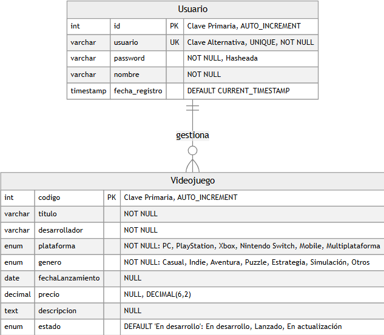
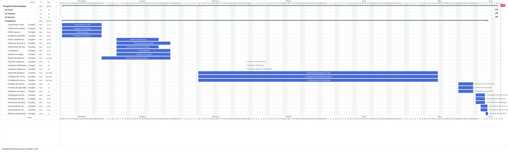

# Diseño y planificación

### **Decisiones de Diseño**
- **Infraestructura base en AWS:** Implementación sobre Amazon EC2 con instancias optimizadas para desarrollo, red configurada mediante Amazon VPC, subredes públicas/privadas, reglas de seguridad (Security Groups), NACLs y servicios esenciales como DNS y SSH.
- **Sistema de base de datos:** Implementación de MySQL en contenedores Docker desplegados sobre las instancias de AWS, con volúmenes persistentes para los datos, y control de acceso mediante usuarios y roles.
- **Aplicación web profesional:** Servidor Apache/nginx desplegado en EC2, integrando un WordPress personalizado para el portafolio de videojuegos. Almacenamiento de contenido multimedia en la base de datos por defecto de wordpress.
- **Seguridad y mantenimiento avanzado:** Certificados SSL/TLS gestionados con un servidor propio de SSL.

## Infraestructura del proyecto

La infraestructura final del proyecto se ha simplificado a una única VPC que contiene **dos instancias** dentro de la misma red privada `172.31.0.0`, cada una con su IP pública asociada:

- **Instancia 1 (WordPress)** – Red privada `172.31.0.0` con IP pública `32.192.151.244`.  
  En esta máquina se ejecuta un contenedor Docker con WordPress, que expone el sitio web público de CreviPlay.
- **Instancia 2 (Aplicación + MySQL)** – Red privada `172.31.0.0` con IP pública `18.210.185.204`.  
  Esta instancia alberga un contenedor Docker con MySQL (base de datos del proyecto) y la aplicación del proyecto que consume dicha base de datos.

Ambas máquinas se encuentran dentro de la misma VPC para facilitar la comunicación interna entre los contenedores y la base de datos, manteniendo el acceso externo controlado mediante IPs públicas y reglas de seguridad adecuadas.

## Diseño de la Base de Datos

El diseño de la base de datos está basado en un modelo Entidad-Relación (ER) que refleja las necesidades principales de la plataforma CreviPlay: gestión de usuarios y de videojuegos. Un usuario del sistema puede gestionar múltiples videojuegos mediante la relación **gestiona**. La estructura garantiza la integridad de los datos y permite escalar el catálogo de videojuegos de forma ordenada.

### Principales entidades y relaciones

- **Usuario**: Almacena la información de cada usuario del sistema. Atributos principales: `id` (clave primaria, autoincremental), `usuario` (único, para login), `password` (almacenada de forma hasheada), `nombre` y `fecha_registro` (timestamp por defecto).
- **Videojuego**: Contiene el catálogo de videojuegos. Incluye `codigo` (clave primaria, autoincremental), `titulo`, `desarrollador`, `plataforma` (enum: PC, PlayStation, Xbox, Nintendo Switch, Mobile, Multiplataforma), `genero` (enum: Casual, Indie, Aventura, Puzzle, Estrategia, Simulación, Otros), `fechaLanzamiento`, `precio` (decimal 6,2), `descripcion`, y `estado` (enum: En desarrollo, Lanzado, En actualización; por defecto «En desarrollo»).
- **Relación gestiona**: Es una relación **uno a muchos** (1:N) entre Usuario y Videojuego. Un usuario puede gestionar cero o muchos videojuegos; cada videojuego es gestionado por un único usuario. La clave foránea se implementa en la tabla Videojuego referenciando el `id` del Usuario.

### Diagrama Entidad-Relación

A continuación se muestra el modelo ER realizado. El diagrama resume de forma visual la estructura de la base de datos, sus tablas principales, atributos y relaciones clave.

    Figura: Modelo Entidad-Relación principal de la base de datos CreviPlay

## Diseño de la pagina web

Para este proyecto de 2º de ASIR, se ha optado por una solución práctica y funcional que permita demostrar los conocimientos adquiridos sin requerir un nivel de complejidad excesivo. La página web se desarrollará utilizando **WordPress** como sistema de gestión de contenidos (CMS), lo que facilitará la implementación y permitirá centrarse en los aspectos de infraestructura y administración del sistema.

### **Estructura y funcionalidades básicas**

La página web de CreviPlay contará con las siguientes secciones principales:

- **Página de inicio (Home)**: Presentación del estudio, información básica y acceso rápido a los proyectos destacados.
- **Portafolio de videojuegos**: Galería donde se mostrarán los proyectos en desarrollo, con imágenes, descripciones y estado de cada proyecto.
- **Sobre nosotros**: Información sobre el equipo de desarrollo y el estudio.
- **Contacto**: Formulario de contacto básico para que publishers o clientes puedan ponerse en contacto con el estudio.

### **Características técnicas**

- **Tema WordPress**: Se utilizará un tema gratuito o de bajo coste, personalizado con los colores y logo de CreviPlay.
- **Plugins esenciales**: Se instalarán plugins básicos para gestión de formularios de contacto y optimización de imágenes.
- **Responsive design**: El tema seleccionado será responsive para que la página sea accesible desde dispositivos móviles.
- **Panel de administración**: Acceso al panel de WordPress para gestionar contenidos, proyectos y usuarios.

### **Consideraciones de diseño**

Dado que este es un proyecto académico de segundo curso, el enfoque se centrará en:

- **Funcionalidad sobre estética**: Priorizar que todas las funcionalidades básicas funcionen correctamente.
- **Simplicidad**: Evitar diseños excesivamente complejos que puedan generar problemas técnicos.

### **Diagrama de Gantt**

Este es el diagrama de Gantt de nuestro proyecto (Sujeto a cambios)

<a href="https://trello.com/invite/b/692dd6254cc1eb9200f5c982/ATTI7a99346f596d27f1b6ba5ae0d74a60ff4779E02B/proyecto-intermodular" target="_blank" rel="noopener noreferrer">Enlace a Trello</a>

### **Matriz de riesgos con estrategias de mitigación**

La siguiente tabla identifica los principales riesgos que podrían surgir durante la implementación práctica del proyecto, junto con estrategias de mitigación para cada uno:

| Riesgo | Descripción | Probabilidad | Impacto | Estrategia de Mitigación |
|--------|-------------|--------------|---------|-------------------------|
| **Configuración incorrecta de Security Groups** | Reglas de firewall mal configuradas que permiten acceso no autorizado o bloquean tráfico legítimo | Media | Alto | Documentar todas las reglas antes de implementar, usar plantillas de seguridad probadas, realizar pruebas de conectividad después de cada cambio, implementar principio de menor privilegio |
| **Pérdida de datos por falta de backups** | Fallo en el sistema de respaldo automático o pérdida de datos críticos | Baja | Alto | Configurar backups automáticos diarios en RDS, verificar regularmente la integridad de los backups |
| **Sobrecostos inesperados en AWS** | Uso excesivo de recursos que genera facturas elevadas | Alta | Alta | Usar instancias de tamaño apropiado, pensar en hacerlo en varios laboratorios y al final levantarlo todo en un mismo laboratorio |
| **Problemas de conectividad de red** | Configuración incorrecta de VPC, subredes o rutas que impide la comunicación entre servicios | Media | Alto | Diseñar topología de red antes de implementar, usar diagramas de red, probar conectividad entre cada componente, documentar todas las configuraciones de red |
| **Rendimiento insuficiente** | Tiempos de carga superiores a 2 segundos o saturación del servidor | Media | Medio | Implementar CloudFront, optimizar imágenes y recursos estáticos, usar caché en WordPress, realizar pruebas de carga antes del despliegue |
| **Problemas con la base de datos RDS** | Fallos de conexión, pérdida de rendimiento o errores en consultas | Baja | Alto | Configurar RDS multi-AZ para alta disponibilidad, monitorear métricas de rendimiento, optimizar consultas SQL, realizar mantenimiento preventivo regular |
| **Pérdida de acceso remoto** | Problemas con SSH o acceso a instancias EC2 que impiden la administración | Baja | Alto | Mantener múltiples métodos de acceso (SSH, RDP), almacenar claves de forma segura |

**Leyenda de Probabilidad e Impacto:**

- **Probabilidad:** Alta (frecuente), Media (ocasional), Baja (raro)

- **Impacto:** Alto (crítico para el proyecto), Medio (afecta funcionalidad), Bajo (menor inconveniente)

### **Roles del equipo**

- Líder de proyecto: Alejandro Mariño.
- Administrador de sistemas: Iker Sanchez.
- Desarrollador web: Alejandro Mariño.
- Administrador de base de datos: Alejandro Mariño y Iker Sanchez.
- Especialista en seguridad: Iker Sanchez.
- Documentador: Alejandro Mariño y Iker Sanchez.