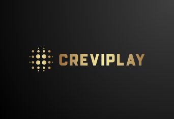

# Infraestructura completa de TI y plataforma web para CreviPlay

## Portada

  

## Sinopsis del Proyecto

CreviPlay es un nuevo estudio de desarrollo de videojuegos independiente que se está estableciendo en Crevillent. El estudio está formado por un pequeño equipo de desarrolladores locales que buscan crear videojuegos casuales e indie para múltiples plataformas.

El proyecto ha desplegado una infraestructura completa en **AWS** con cuatro instancias EC2 especializadas: WordPress (CMS corporativo), aplicación PHP (gestión del catálogo), servidor DNS (BIND) y base de datos MySQL con phpMyAdmin. Todos los servicios están contenerizados con **Docker Compose** y documentados en las secciones de diseño, desarrollo y resultados.